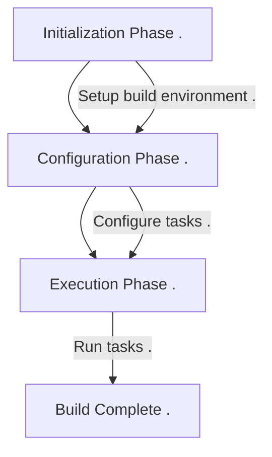

+++
title = "With AGP to 500+ white label apps"
outputs = ["Reveal"]
  
[reveal_hugo]  
theme = "dracula"
highlight_theme = "night-owl"
slide_number = true 
transition = "slide"
+++


### With AGP to 500+ white label apps


---
### Gradle 101

* Lifecycle
* Implicit task dependency
* Provider APIs

---
### Lifecycle 3 stages



---
{}
### Implicit  Task Dependency
---
#### Managed Type

Ultimately, the annotated properties end up inside

`org.gradle.api.tasks.TaskInputs` and 

`org.gradle.api.tasks.TaskOutputs` as "these types have their state entirely managed by Gradle".

---
#### Producer Task

```kotlin{}
abstract class ProducerTask: DefaultTask() {  
    @get:OutputFile  
    abstract val outputFile: RegularFileProperty  
  
    @TaskAction  
    fun action() {  
        logger.lifecycle("Producer: ${outputFile.get()}")  
        outputFile.get().asFile.writeText("foobar")  
    }  
}  
```

---
#### Consumer Task
```kotlin{}
abstract class ConsumerTask : DefaultTask() {  
    @get:InputFile  
    abstract val inputFile: RegularFileProperty  
  
    @TaskAction  
    fun test() {  
        logger.lifecycle("Consumer: ${inputFile.get()}, Content: ${inputFile.get().asFile.readText()}")  
    }  
}
```

---
## Bad Wiring

You should not configure paths manually like that.

```kotlin{4,7}
val myFile = project.layout.buildDirectory.file("license.txt")

project.tasks.register<ProducerTask>(name = "produceFile") {  
    outputFile.set(myFile)  
}  
project.tasks.register<ConsumerTask>(name = "consumeFile") {  
    inputFile.set(myFile)  
}
```

---
## Good Wiring

You should wire task output properties to task input properties.

```kotlin{3,5,8}
val myFile = project.layout.buildDirectory.file("license.txt")

val producerTask: TaskProvider<ProducerTask> =
project.tasks.register<ProducerTask>(name = "produceFile") {  
    outputFile.set(myFile)  
}  
project.tasks.register<ConsumerTask>(name = "consumeFile") {  
    inputFile.set(producerTask.flatMap { it.outputFile })  
}
```

---

An added benefit of connecting input and output properties like this is that **Gradle automatically detects** task dependencies based on such connections.

{}

---
{}
### Provider API 101

`Provider` Represents a value that can only be queried and cannot be changed.

---
`Property` extends `Provider`.
`Property` Represents a value that can be queried and changed.

---
`Provider` is a tool for lazy evaluation.

```kotlin{}
Observable.fromCallable {} // RX

callbackFlow {} // coroutine
```

---
**Gradle 9** will apply bytecode transforms [behind the scenes](https://blog.gradle.org/road-to-gradle-9#lazy-apis-and-bytecode-transforms).

{}

---

{}
### Setup
---
### Gradle Plugin Development Plugin

```kotlin{9-19}
plugins {  
	`java-gradle-plugin`  
}

dependencies {
	implementation("com.android.tools.build:gradle:8.6.1")
}

gradlePlugin {  
    plugins {  
        val pluginId = "build.logic.android.metadata"  
        create(pluginId) {  
            id = pluginId  
            implementationClass = "my.package.AndroidMetadataPlugin"  
            version = "1.0"  
            group = "build.logic"  
        }  
    }
}
```

---
### Hooking Into Plugin

```kotlin{6-8}
import org.gradle.api.Plugin  
import org.gradle.api.Project  
  
abstract class AndroidMetadataPlugin : Plugin<Project> {  
    override fun apply(project: Project) {  
        pluginManager.withPlugin("com.android.application") {
           setupPlugin(project)
        }
    }  
}
```

---
### Peek Your Extension

```kotlin{1-3,6-9}
import org.gradle.kotlin.dsl.the
import com.android.build.gradle.AppExtension
import com.android.build.api.variant.ApplicationAndroidComponentsExtension

private fun setupPlugin(project: Project) = project.run {
	// Older API with a lot of tech debt ¯\_(ツ)_/¯
	the<AppExtension>().run {}
	// Latest API available since 2020
	the<ApplicationAndroidComponentsExtension>().run {} 
}
```

{}

---

{}
### 'New' Variant API


---
{}

--- 
### QA
