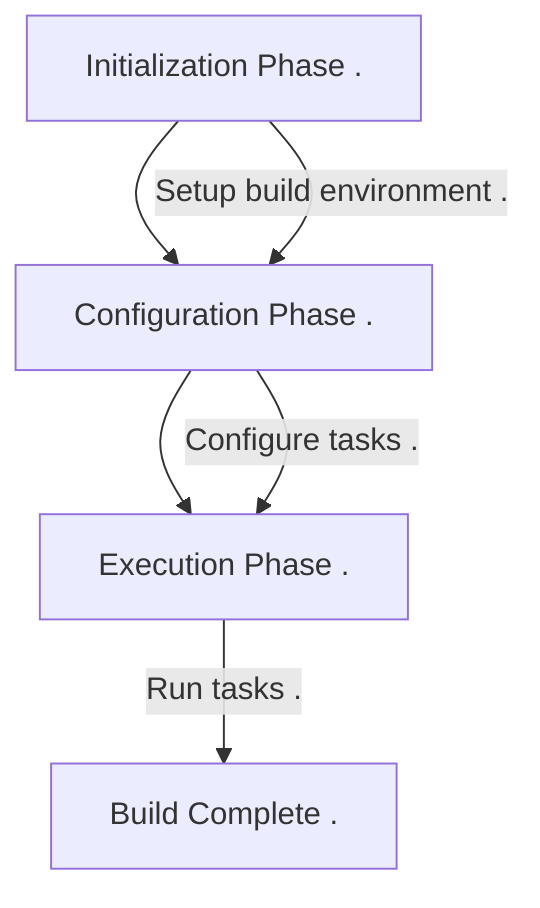

+++
title = "With AGP to 500+ white label apps"
outputs = ["Reveal"]
  
[reveal_hugo]  
theme = "dracula"
highlight_theme = "night-owl"
slide_number = true 
transition = "slide"
+++


### With AGP to 500+ white label apps


---
### Gradle 101

* Lifecycle
* Implicit task dependency
* Provider APIs

---
### Lifecycle 3 stages



---
{}
### Implicit  Task Dependency
---
#### Producer Task

```kotlin{}
abstract class ProducerTask: DefaultTask() {  
    @get:OutputFile  
    abstract val outputFile: RegularFileProperty  
  
    @TaskAction  
    fun action() {  
        logger.lifecycle("Producer: ${outputFile.get()}")  
        outputFile.get().asFile.writeText("foobar")  
    }  
}  
```

---
#### Consumer Task
```kotlin{}
abstract class ConsumerTask : DefaultTask() {  
    @get:InputFile  
    abstract val inputFile: RegularFileProperty  
  
    @TaskAction  
    fun test() {  
        logger.lifecycle("Consumer: ${inputFile.get()}, Content: ${inputFile.get().asFile.readText()}")  
    }  
}
```

---
## Bad Wiring

You should not configure paths manually like that.

```kotlin{4,7}
val myFile = project.layout.buildDirectory.file("license.txt")

project.tasks.register<ProducerTask>(name = "produceFile") {  
    outputFile.set(myFile)  
}  
project.tasks.register<ConsumerTask>(name = "consumeFile") {  
    inputFile.set(myFile)  
}
```

---
## Good Wiring

You should wire task output properties to task input properties.

```kotlin{3,5,8}
val myFile = project.layout.buildDirectory.file("license.txt")

val producerTask: TaskProvider<ProducerTask> =
project.tasks.register<ProducerTask>(name = "produceFile") {  
    outputFile.set(myFile)  
}  
project.tasks.register<ConsumerTask>(name = "consumeFile") {  
    inputFile.set(producerTask.flatMap { it.outputFile })  
}
```

---

An added benefit of connecting input and output properties like this is that **Gradle automatically detects** task dependencies based on such connections.

{}

---
### QA
