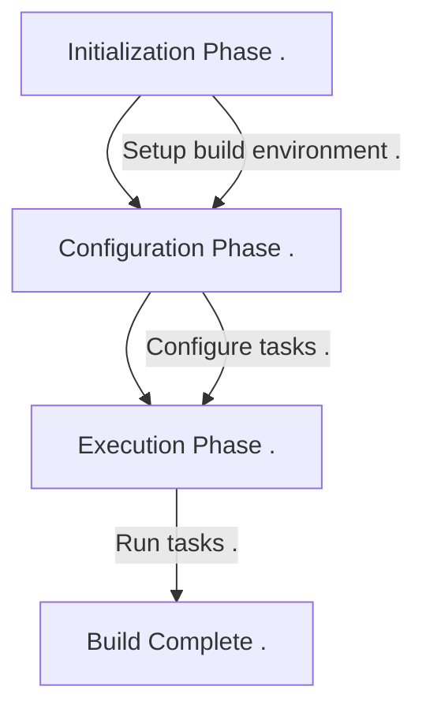

+++
title = "With AGP to 500+ white label apps"
outputs = ["Reveal"]
[reveal_hugo]
custom_theme = "reveal-hugo/themes/robot-lung.css"
margin = 0.2
highlight_theme = "color-brewer"
transition = "slide"
transition_speed = "fast"
+++


# With AGP to 500+ white label apps


---
{}
# Gradle 101

* Lifecycle
* Implicit task dependency
* Provider APIs

---
# 3 stages





---
# Implicit task dependency

```kotlin
abstract class ProducerTask: DefaultTask() {  
    @get:OutputFile  
    abstract val outputFile: RegularFileProperty  
  
    @TaskAction  
    fun action() {  
        logger.lifecycle("Producer: ${outputFile.get()}")  
        outputFile.get().asFile.writeText("foobar")  
    }  
}  
  
abstract class ConsumerTask : DefaultTask() {  
    @get:InputFile  
    abstract val inputFile: RegularFileProperty  
  
    @TaskAction  
    fun test() {  
        logger.lifecycle("Consumer: ${inputFile.get()}, Content: ${inputFile.get().asFile.readText()}")  
    }  
}
```

---
# Bad Wiring

```kotlin
val myFile = project.layout.buildDirectory.file("license.txt")

project.tasks.register<ProducerTask>(name = "produceFile") {  
    outputFile.set(myFile)  
}  
project.tasks.register<ConsumerTask>(name = "consumeFile") {  
    inputFile.set(myFile)  
}
```

---
Good Wiring

```kotlin
val myFile = project.layout.buildDirectory.file("license.txt")

val producerTask: TaskProvider<ProducerTask> = project.tasks.register<ProducerTask>(name = "produceFile") {  
    outputFile.set(myFile)  
}  
project.tasks.register<ConsumerTask>(name = "consumeFile") {  
    inputFile.set(producerTask.flatMap { it.outputFile })  
}
```


{}

---